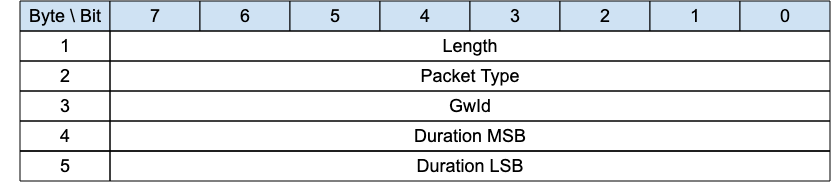

<!-- transformation-note: left upstream numbering of headings for verification -->
### 3.1.1 ADVERTISE - Gateway Advertisement{#advertise}

{#fig:advertise-packet}

The ADVERTISE packet is sent periodically by the gateway to advertise its presence.
The time interval until the next transmission is indicated by the _Duration_ field.

>**Informative comment**
>
>If the Transport Layer supports multicast, like UDP/IP, the ADVERTISE packet is generally sent using the Multicast Address as destination.

#### 3.1.1.1 Length &amp; Packet Type{#advertise--length-and-packet-type}

The first 2 or 4 bytes of the packet are encoded according to the variable length packet header format.
Refer to [section 2.1](#structure-of-an-mqtt-sn-control-packet) for a detailed description.

#### 3.1.1.2 GwId{#advertise--gwid}

The _GwId_ field is at least 1-byte identifier and uniquely identifies a gateway which is advertising itself in the network.

The MQTT-SN protocol itself doesn’t guarantee the uniqueness of the _GwId_ field.

>**Informative comment**
>
>If the Gateway has a MAC address, it can be used as _GwId_. 

#### 3.1.1.3 Duration

The _Duration_ field is a 2-byte integer.
It specifies the time interval in seconds until the next ADVERTISE packet is transmitted by this gateway period. 

The maximum value that can be encoded is approximately 18 hours.
