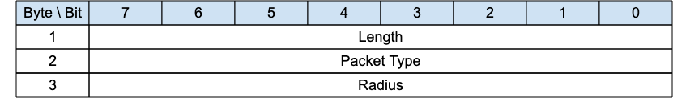

<!-- transformation-note: left upstream numbering of headings for verification -->
### 3.1.2 SEARCHGW - Search for A Gateway{searchgw}

{#fig:searchgw-packet}

The SEARCHGW packet is sent by a client when it searches for a Gateway.
The transmission radius of the SEARCHGW is limited and depends on the density of the clients deployment,
e.g. only 1-hop transmission in case of a very dense network in which every MQTT-SN client is reachable from each other within 1-hop transmission.

>**Informative comment**
>
>If the Transport Layer supports multicast, like UDP/IP, the SEARCHGW packet is generally sent using the Multicast Address as destination..

<!-- transformation-note: left upstream numbering of headings for verification -->
#### 3.1.2.1 Length &amp; Packet Type{#searchgw--length-and-packet-type}

The first 2 or 4 bytes of the packet are encoded according to the variable length packet header format.
Refer to [section 2.1](#structure-of-an-mqtt-sn-control-packet) for a detailed description.

<!-- transformation-note: left upstream numbering of headings for verification -->
#### 3.1.2.2 Radius{#searchgw--radius}

The transmission radius is also indicated to the underlying network layer when MQTT-SN gives this packet for transmission.

A Client or a Gateway MUST NOT forward the SEARCHGW received if the Radius value is 0.

If a Client or a Gateway forwards the SEARCHGW received, it MUST reduce the Radius value by 1.
