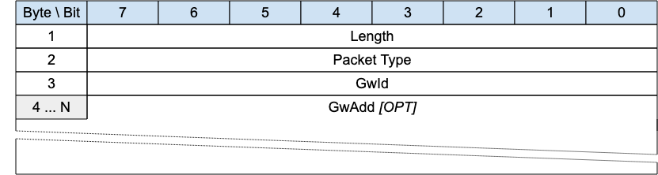

<!-- transformation-note: left upstream numbering of headings for verification -->
### 3.1.3 GWINFO - Gateway Information{#gwinfo}

{#fig:gwinfo-packet}

The GWINFO packet is sent as response to a SEARCHGW packet with the radius as indicated in the SEARCHGW packet.
If sent by a Gateway, it contains only the id of the sending Gateway; otherwise, if sent by a client, it also includes the address of the Gateway.

>**Informative comment**
>
>If the Transport Layer supports multicast, like UDP/IP, the GWINFO packet is generally sent using the Multicast Address as destination.

<!-- transformation-note: left upstream numbering of headings for verification -->
#### 3.1.3.1 Length &amp; Packet Type{#gwinfo--length-and-packet-type}

The first 2 or 4 bytes of the packet are encoded according to the variable length packet header format.
Refer to [section 2.1](#structure-of-an-mqtt-sn-control-packet) for a detailed description.

<!-- transformation-note: left upstream numbering of headings for verification -->
#### 3.1.3.2 GwId{#gwinfo--gwid}

The _GwId_ field is 1-byte long and uniquely identifies a Gateway in the network.

<!-- transformation-note: left upstream numbering of headings for verification -->
#### 3.1.3.3 GwAdd

The _GwAdd_ field has a variable length and contains the address of a Gateway.
Its length depends on the type of network over which MQTT-SN operates and is specified by the Length byte.
Optional, only included if the packet is sent by a client.
