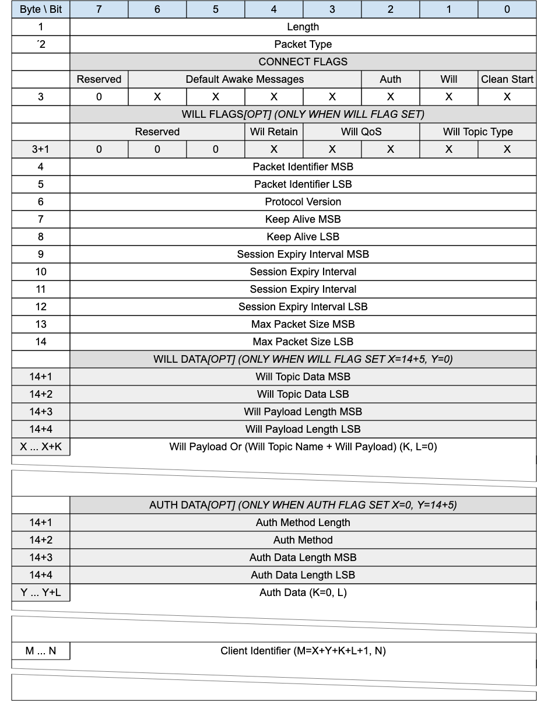

<!-- transformation-note: left upstream numbering of headings for verification -->
### 3.1.4 CONNECT - Connection Request{#connect}

{#fig:connect-packet}

The CONNECT packet is sent from the Client to the Gateway to create a Virtual Connection able to create or continue a Session. 

<!-- transformation-note: left upstream numbering of headings for verification -->
#### 3.1.4.1 Length &amp; Packet Type{#connect--length-and-packet-type}

The first 2 or 4 bytes of the packet are encoded according to the variable length packet header format.
Refer to [section 2.1](#structure-of-an-mqtt-sn-control-packet) for a detailed description.

<!-- transformation-note: left upstream numbering of headings for verification -->
#### 3.1.4.2 Connect Flags

The Connect Flags is 1 byte field which contains several parameters specifying the behavior of the MQTT-SN Virtual Connection. 

The Connect _Flags_ field includes the following flags:

* **Clean Start:** Stored in Bit 0 and specifies whether the Virtual Connection starts a new Session or is a continuation of an existing Session
* **Will**: Stored in Bit 1 and if set to 1 it indicates that the Will Flags and the Will Data sections are present
* **Auth**: Stored in Bit 2 and indicates if the packet contains authentication data
* **Default Awake Messages**: A value between 0-15 to indicate the maximum number of messages a client shall receive during an AWAKE session.
  Specifying 0 will mean it is up to the gateway to determine how many messages it will send, which may be unbounded.

The Gateway MUST validate that the reserved flags in the CONNECT packet are set to 0.
If any of the reserved flags is not 0 it is a Malformed Packet.

<!-- transformation-note: left upstream numbering of headings for verification -->
#### 3.1.4.3 Packet Identifier{#connect--packet-identifier}

Used to identify the corresponding CONNACK packet.
It should ideally be populated with a random integer value.

<!-- transformation-note: left upstream numbering of headings for verification -->
#### 3.1.4.4 Protocol Version

The one-byte unsigned value that represents the revision level of the protocol used by the Client. 

| Protocol Version             |    Value    |
|:-----------------------------|:-----------:|
| Version 1.2                  |    0x01     |
| **Version 2.0**              |  **0x02**   |
| Reserved for future versions | 0x03 – 0xFF |

Table: Protocol version values

The value of the Protocol Version field for MQTT-SN version 2.0 MUST be 2 (0x02).

A Gateway which supports multiple versions of the MQTT-SN protocol uses
the Protocol Version to determine which version of MQTT-SN the Client is using.
If the Protocol Version is not 2 and the Gateway does not want to accept the CONNECT packet,
the Server MAY send a CONNACK packet with Reason Code 0x84 (Unsupported Protocol Version).

<!-- transformation-note: left upstream numbering of headings for verification -->
#### 3.1.4.5 Keep Alive Timer

The Keep Alive is a Two Byte Integer greater than 0 (1 - 65,535), which is a time interval measured in seconds.
It is the maximum time interval that is permitted to elapse between the point at which the Client finishes transmitting
one MQTT-SN Control Packet and the point it starts sending the next.
It is the responsibility of the Client to ensure that the interval between MQTT-SN Control Packets being sent does not exceed the Keep Alive value. In the absence of sending any other MQTT-SN Control Packets, the Client MUST send a PINGREQ packet.

>**Informative comment**
>
>The Client can send PINGREQ at any time, irrespective of the Keep Alive value,
>and check for a corresponding PINGRESP to determine that the network and the Gateway are available.

If the Gateway does not receive an MQTT-SN Control Packet from the Client within one and a half times the Keep Alive time period,
it MUST consider the session ‘LOST’ (see state description in table 3.6).

If a Client does not receive a PINGRESP packet within a *Tretry* amount of time after it has sent a PINGREQ,
it SHOULD retry the transmission according to [section 4.24](unacknowledged-packets) up to the maximum number of attempts.
If a PINGRESP is still not received it MUST close the Session to the Gateway by way of a DISCONNECT,
with the understanding that the GW may no longer be reachable.

A Keep Alive must have a value greater than 0.
It is considered a protocol error If a Keep Alive value of 0 is set.

>**Informative comment**  
>
>The Gateway may have other reasons to disconnect the Client, for instance because it is shutting down.
>Setting Keep Alive does not guarantee that the Client will remain connected.

>**Informative comment**
>
>The actual value of the Keep Alive is application specific; typically, this is a few minutes.
>The maximum value of 65,535 is 18 hours 12 minutes and 15 seconds.

<!-- transformation-note: left upstream numbering of headings for verification -->
#### 3.1.4.6 Session Expiry Interval{#connect--session-expiry-interval}

The Session Expiry Interval is a four-byte integer time interval measured in seconds.
If the Session Expiry Interval is set to 0,
the Session ends (and state deleted) when a (non SLEEPING) DISCONNECT packet is sent from either the client or gateway. 

If the Session Expiry Interval is 0xFFFFFFFF (UINT\_MAX), the Session does not expire. 

The Client and Gateway MUST store the Session State after a DISCONNECT is issued if the Session Expiry Interval is greater than 0.

>**Informative comment**
>
>The clock in the Client or Gateway may not be running for part of the time interval,
>for instance because the Client or Gateway are not running. This might cause the deletion of the state to be delayed.

>**Informative comment**
>
>The client and gateway between them should negotiate a reasonable and practical session expiry interval according to the network and
>infrastructure environment in which they are deployed.
>For example, it would not be practical to set a session – expiry – interval of many months on a gateway whose hardware is
>only capable of storing a few client sessions.

<!-- transformation-note: left upstream numbering of headings for verification -->
#### 3.1.4.7 Maximum Packet Size

A Two Byte (16-bit) Integer representing the Maximum Packet Size the Client is willing to accept.
If the Maximum Packet Size is set to 0, no limit on the packet size is imposed beyond the limitations in the protocol as
a result of the remaining length encoding and the protocol header sizes.

>**Informative comment**
>
>It is the responsibility of the application to select a suitable Maximum Packet Size value if it chooses to restrict the Maximum Packet Size.

The packet size is the total number of bytes in an MQTT-SN Control Packet, as defined in [section 2.1](structure-of-an-mqtt-sn-control-packet).
The Client uses the Maximum Packet Size to inform the Server that it will not process packets exceeding this limit.

The Gateway MUST NOT send packets exceeding Maximum Packet Size to the Client.
If a Client receives a packet whose size exceeds this limit, this is a Protocol Error,
the Client uses DISCONNECT with Reason Code 0x95 (Packet too large).

Where a Packet is too large to send,
the Gateway MUST discard it without sending it and then behave as if it had completed sending that Application Message.

>**Informative comment**
>
>Where a packet is discarded without being sent, the Gateway could take some diagnostic action including alerting the Server administrator.
>Such actions are outside the scope of this specification.

<!-- transformation-note: left upstream numbering of headings for verification -->
#### 3.1.4.8 Client Identifier (ClientID){#connect--client-identifier}

The Client Identifier (ClientID) identifies the Client to the Gateway.
Each Client connecting to the Gateway has a unique ClientID.
The ClientID MUST be used by Clients and by Gateway to identify
the state that they hold relating to this MQTT-SN Session between the Client and the Gateway. 

>**Informative comment**
>
>A Client Identifier can be between 0 - 65,521 bytes.
>We advise for practicality, ClientID’s are restricted to a reasonable size (less than 243 bytes to fit within a small CONNECT packet).

When the clientID is present (greater than 0 bytes), the Gateway MUST allow values which are between 1 and 23 UTF-8 encoded bytes in length,
and that contain only the characters "0123456789abcdefghijklmnopqrstuvwxyzABCDEFGHIJKLMNOPQRSTUVWXYZ”. 

The Gateway may choose to allow more than 23 bytes.

The Client Identifier MUST be a UTF-8 Encoded String. 

<!-- transformation-note: left upstream numbering of headings for verification -->
#### 3.1.4.9 Connect Will Flags (optional, only with _Will_ flag set){#connect--connect-will-flags}

The Connect optional *Will Flags* is 1 byte field which contains several parameters specifying the handling of the Will Message.
It is present only if the Will flag in the Connect _Flags_ contains the value 1.

The Connect optional _Will Flags_ field includes the following flags:

* **Will Topic Type:** This is a 2-bit field in Bit 0 and 1 which determines the format of the topic value.
  Refer to [Table 10](#topic-types) for the definition of the various topic types.
* **Will QoS**: Stored in Bit 2 and 3, these two bits specify the QoS level to be used.
  The value of Will QoS can be 0 (0x00), 1 (0x01), or 2 (0x02). A value of 3 (0x03) is a Malformed Packet.
* **Will Retain**: Stored in Bit 4, this bit specifies if the Will Message is to be retained when it is published.

If the Will Flag is set to 1 this indicates that a Will Message MUST be stored on the Server and associated with the Session \[MQTT-SN-3.1.4.9-1].
The Will Message consists of the Will Topic, and Will Payload fields in the CONNECT Packet.
The Will Message MUST be published after the Virtual Connection is deleted or the Session ends,
unless the Will Message has been deleted by the Server on receipt of a DISCONNECT packet with Reason Code 0x00
(Normal disconnection) \[MQTT-SN--3.1.4.9-2].

Situations in which the Will Message is published include, but are not limited to:

* An I/O error or network failure detected by the Server.  
* The Client fails to communicate within the Keep Alive time.  
* The Server deletes the Virtual Connection because of a protocol error.

If the Will Flag is set to 1, the Will Topic, and Will Payload fields MUST be present in the Packet \[MQTT-SN-3.1.4.9-3].
The Will Message MUST be removed from the stored Session State in the Server once it has been published or
the Server has received a DISCONNECT packet with a Reason Code of 0x00 (Normal disconnection) from the Client \[MQTT-SN-3.1.4.9-4].

The Server SHOULD publish Will Messages promptly after the Virtual Connection is deleted or the Session ends, whichever occurs first.
In the case of a Server shutdown or failure, the Server MAY defer publication of Will Messages until a subsequent restart.
If this happens, there might be a delay between the time the Server experienced failure and when the Will Message is published.

<!-- transformation-note: left upstream numbering of headings for verification -->
#### 3.1.4.10 Will Topic Short or Will Topic Length (optional, only with _Will_ flag set){#connect--will-topic-alias-or-will-topic-length}

In the case of Will Topic Type being b11 this field will refer to the length of data assigned to the “Will Full Topic Name”, in all other cases,
this will be the value used as the Will topic alias or Will short topic name.

<!-- transformation-note: left upstream numbering of headings for verification -->
#### 3.1.4.11 Will Payload Length (optional, only with _Will_ flag set){#connect--will-payload-length}

Contains the length of the Will Payload field.

<!-- transformation-note: left upstream numbering of headings for verification -->
#### 3.1.4.12 Will Payload (optional, only with _Will_ flag set){#connect--will-payload}

It contains the content of the Will Message which is published after the Virtual Connection is deleted.  

In the case of Topic Type b11 the payload section will be prefixed with a "Will Full Topic Name" encoded with a UTF-8 encoded string value of
length determined by the previously defined length field.
Thereafter, the *Will Payload* field corresponds to the MQTT Will Payload and so it defines the Application Message Payload that
is to be published to the Will Topic and this field consists of Binary Data.
It has a variable length defined by the Will Payload Length fields.

<!-- transformation-note: left upstream numbering of headings for verification -->
#### 3.1.4.13 Authentication Method Length (optional, only with _Auth_ flag set){#connect--authentication-method-length}

Single byte value (max 0-255 bytes), representing the length of field used to specify the authentication method.
Refer to [section 4.11](#enhanced-authentication) for more information about extended authentication.
<!-- transformation-note: fixed above ref - but numberings should only be temporary anyways -->

<!-- transformation-note: left upstream numbering of headings for verification -->
#### 3.1.4.14 Authentication Method (optional, only with _Auth_ flag set){#connect--authentication-method}

A UTF-8 Encoded String containing the name of the authentication method.
Refer to [section 4.11](#enhanced-authentication) for more information about extended authentication.
information about extended authentication.
<!-- transformation-note: fixed above ref - but numberings should only be temporary anyways -->

<!-- transformation-note: left upstream numbering of headings for verification -->
#### 3.1.4.15 Authentication Data Length (optional, only with _Auth_ flag set){#connect--authentication-data-length}

Two byte value (max 0-65535 bytes), representing the length of field used to specify the authentication data.
Refer to [section 4.11](#enhanced-authentication) for more information about extended authentication.
<!-- transformation-note: fixed above ref - but numberings should only be temporary anyways -->

<!-- transformation-note: left upstream numbering of headings for verification -->
#### 3.1.4.16 Authentication Data (optional, only with _Auth_ flag set){#connect--authentication-data}

Binary Data containing authentication data. The contents of this data are defined by the authentication method.
Refer to [section 4.11](#enhanced-authentication) for more information about extended authentication.
<!-- transformation-note: fixed above ref - but numberings should only be temporary anyways -->

<!-- transformation-note: left upstream numbering of headings for verification -->
#### 3.1.4.17 CONNECT Actions

Note that a Server MAY support multiple protocols on the same network endpoint.
If the Server determines that the protocol is MQTT-SN 2.0 then it validates the connection attempt as follows.

1. The Server MUST validate that the CONNECT packet matches the format described in [section 3.1.4](#connect---connection-request)
   and MUST NOT create a Virtual Connection for this CONNECT if it does not match. \[MQTT-SN-3.1.4.17-1]
   The Server MAY send a CONNACK with a Reason Code of 0x80 or greater as described in [section 4.12](#handling-errors).  
1. The Server MAY check that the contents of the CONNECT packet meet any further restrictions and SHOULD perform authentication
   and authorization checks. If any of these checks fail, it MUST NOT create a Virtual Connection for this CONNECT \[MQTT-SN-3.1.4.17-2].
   It MAY send an appropriate CONNACK response with a Reason Code of 0x80 or greater as described in
   [section 3.1.5](#connack---connect-acknowledgement) and [section 4.12](#handling-errors).

If validation is successful, the Server performs the following steps.

1. If the ClientID represents a Client already connected to the Server, the Server sends a DISCONNECT packet to the existing Client with
   Reason Code of 0x8E (Session taken over) as described in [section 4.12](#handling-errors)
   and MUST delete the Virtual Connection of the existing Client \[MQTT-SN-3.1.4.17-3].
   If the existing Client has a Will Message, that Will Message is published as described in section 3.1.2.5.   
1. The Server MUST perform the processing of Clean Start that is described in [section 4.16](#clean-start) \[MQTT-SN-3.1.4.17-4].  
1. The Server MUST acknowledge the CONNECT packet with a CONNACK packet containing a 0x00 (Success) Reason Code \[MQTT-SN-3.1.4.17-5].  
1. Start Application Message delivery and Keep Alive monitoring.

>**Informative comment**
>
>It is recommended that authentication and authorization checks be performed if the Server is being used to process
>any form of business critical data.
>If these checks succeed, the Server responds by sending CONNACK with a 0x00 (Success) Reason Code.
>If they fail, it is suggested that the Server does not send a CONNACK at all,
>as this could alert a potential attacker to the presence of the MQTT-SN Server
>and encourage such an attacker to launch a denial of service or password-guessing attack.

Clients are allowed to send further MQTT Control Packets immediately after sending a CONNECT packet;
Clients need not wait for a CONNACK packet to arrive from the Server.
If the Server rejects the CONNECT, it MUST NOT process any data sent by the Client after the CONNECT packet except AUTH packets \[MQTT-3.1.4-6].

>**Informative comment**
>
>Clients typically wait for a CONNACK packet, However,
>if the Client exploits its freedom to send MQTT-SN Control Packets before it receives a CONNACK,
>it might simplify the Client implementation as it does not have to police the connected state.
>The Client accepts that any data that it sends before it receives a CONNACK packet from the Server will not be processed if
>the Server rejects the connection.

>**Informative comment**
>
>Clients that send MQTT-SN Control Packets before they receive CONNACK will be unaware of Server information including whether
>any existing Session is being used.

>**Informative comment**
>
>The Server can limit reading from the Network if the Client sends too much data before authentication is complete.
>This is suggested as a way of avoiding denial of service attacks.
