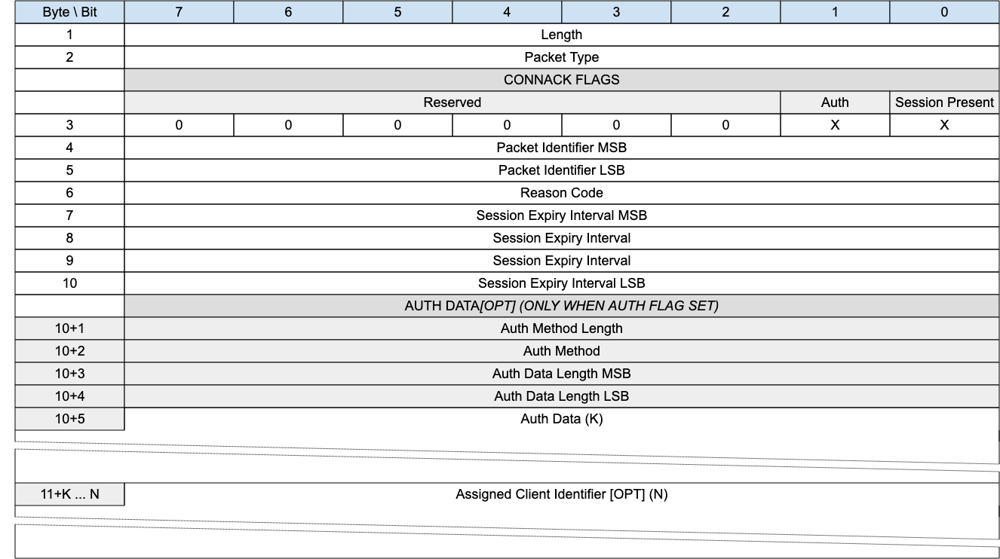

<!-- transformation-note: left upstream numbering of headings for verification -->
### 3.1.5 CONNACK

{#fig:connack-packet}

The CONNACK packet is sent by the Gateway in response to a Virtual Connection request from a client.

<!-- transformation-note: left upstream numbering of headings for verification -->
#### 3.1.5.1 Length &amp; Packet Type{#connack--length-and-packet-type}

The first 2 or 4 bytes of the packet are encoded according to the variable length packet header format.
Refer to [section 2.1](#structure-of-an-mqtt-sn-control-packet) for a detailed description.

<!-- transformation-note: left upstream numbering of headings for verification -->
#### 3.1.5.2 Connack Flags

The CONNACK FLAGS is a 1 byte field located at byte 4 which contains flags specifying the behavior of the MQTT-SN Virtual Connection on the gateway.
[Bits 7-2 of the CONNACK FLAGS are reserved and MUST be set to 0]{.mark}.

The Connack *Flags* field includes the following flags:

-   **Session Present:** Stored in Bit 0 and specifies whether an existing session was present on the gateway for the given client identifier. A value
    of 1 indicates a session was present, a value 0 indicates no session was present.\
    \
    [If the Gateway accepts a CONNECT with Clean Start set to 1, the Gateway MUST set Session Present to 0 in the CONNACK Packet in addition to
    setting a 0x00 (Success) Reason Code in the CONNACK packet.]{.mark}

> [If the Gateway accepts a CONNECT with Clean Start set to 0 and the Gateway has Session State for the client identifier it MUST set Session Present
> to 1 in the CONNACK packet, otherwise it MUST set Session Present to 0 in the CONNACK packet. In both cases it MUST set a 0x00 (Success) Reason Code
> in the CONNACK packet.]{.mark}\
> \
> If the value of Session Present received by the Client from the Gateway is not as expected, the Client proceeds as follows:
>
> [If the Client does not have Session State and receives Session Present set to 1 it MUST delete the Virtual Connection.]{.mark} [If it wishes to
> restart with a new Session the Client can reconnect using Clean Start set to 1.]{.mark}
>
> [If the Client does have Session State and receives Session Present set to 0 it MUST discard its Session State if it continues with the Virtual
> Connection.]{.mark}
>
> [If a Gateway sends a CONNACK packet containing a non-zero Reason Code it MUST set Session Present to 0.]{.mark}

-   **Auth:** Stored in Bit 1 and specifies whether the packet contains Auth material that should be considered.

[The Client MUST validate that the reserved flags in the CONNACK packet are set to 0. If any of the reserved flags is not 0 it is a Malformed
Packet.]{.mark}

<!-- transformation-note: left upstream numbering of headings for verification -->
#### 3.1.5.3 Packet Identifier{#connack--packet-identifier}

The same value as the Packet Identifier in the CONNECT Packet being acknowledged.

<!-- transformation-note: left upstream numbering of headings for verification -->
#### 3.1.5.4 Reason Code{#connack--reason-code}

<!-- transformation-note: the below table ref upstream 9 "Reason Code Values" needs verification before transforming into a semantic ref later. -->
Byte 5 in the CONNACK header contains the Connect Reason Code. The values for the Connect Reason Code field are shown in Table 9: Reason Code Values.
[The Server sending the CONNACK packet MUST use one of the Connect Reason Code values.]{.mark}

[If a Server sends a CONNACK packet containing a Reason code of]{.mark} [128 or greater it MUST then delete the Virtual Connection.]{.mark}

<!-- transformation-note: left upstream numbering of headings for verification -->
#### 3.1.5.5 Session Expiry Interval{#connack--session-expiry-interval}

If the Session Expiry Interval is 0, the value of Session Expiry Interval in the CONNECT Packet is used. *The server uses this property to inform the
Client that it is using a value other than that sent by the Client in the CONNECT*.

<!-- transformation-note: left upstream numbering of headings for verification -->
#### 3.1.5.6 Authentication Method Length (optional, only with Auth flag set){#connack--authentication-method-length}

Single byte value (max 0-255 bytes), representing the length of field used to specify the authentication method. Refer to LINKED TO AUTH for more
information about extended authentication.

<!-- transformation-note: left upstream numbering of headings for verification -->
#### 3.1.5.7 Authentication Method (optional, only with Auth flag set){#connack--authentication-method}

A UTF-8 Encoded String containing the name of the authentication method. Refer to LINKED TO AUTH for more information about extended authentication.

<!-- transformation-note: left upstream numbering of headings for verification -->
#### 3.1.5.8 Authentication Data Length (optional, only with Auth flag set){#connack--authentication-data-length}

Two byte value (max 0-65535 bytes), representing the length of field used to specify the authentication data. Refer to LINKED TO AUTH for more
information about extended authentication.

<!-- transformation-note: left upstream numbering of headings for verification -->
#### 3.1.5.9 Authentication Data (optional, only with Auth flag set){#connack--authentication-data}

Binary Data containing authentication data. The contents of this data are defined by the authentication method and the state of already exchanged
authentication data. Refer to LINKED TO AUTH for more information about extended authentication.

<!-- transformation-note: left upstream numbering of headings for verification -->
#### 3.1.5.10 Assigned Client Identifier{#connack--assigned-client-identifier}

The Client Identifier assigned by the gateway when the associated CONNECT packet contained no Client Identifier. [If the Client connects using a zero
length Client Identifier, the Server MUST respond with a CONNACK containing an Assigned Client Identifier. The Assigned Client Identifier MUST be a
new Client Identifier not used by any other Session currently in the Gateway]{.mark}.

[The Assigned Client Identifier MUST be a UTF-8 Encoded String]{.mark}.

> **Informative comment**
>
> Assigned Client Identifiers SHOULD be less than 247 bytes so they can be accommodated in a small packet version. This is also to cater for devices
> which may not support larger Client Identifiers.
>
> **Informative comment**
>
> Where a transparent gateway obtains an Assigned Client Identifier which is deemed too large for a device, it should maintain a registry to map
> shorter gateway generated Client Identifiers with their versions returned from the broker.
