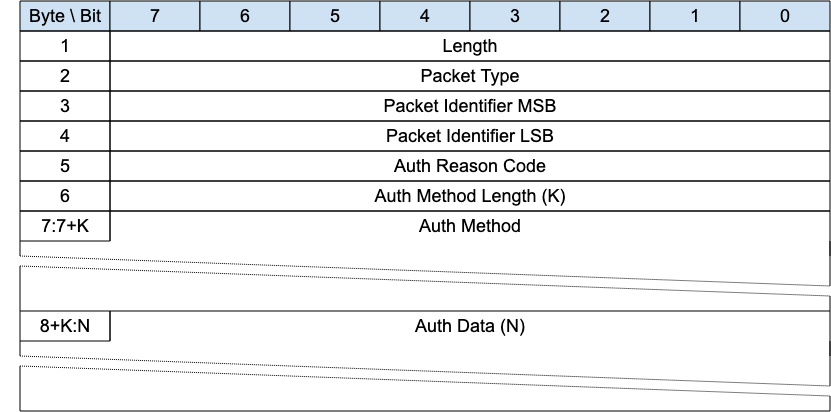

<!-- transformation-note: left upstream numbering of headings for verification -->
### 3.1.6 AUTH

{#fig:auth-packet}

[The authentication method and data is first sent by the Client as part of a CONNECT exchange. If the Server requires additional information to
complete the authentication, it responds with an AUTH packet to signal that the Client generates and sends another AUTH packet with the required
information and so on until the authentication is complete. The server then responds with a CONNACK message.]{.mark}

<!-- transformation-note: left upstream numbering of headings for verification -->
#### 3.1.6.1 Length &amp; Packet Type{#auth--length-and-packet-type}

The first 2 or 4 bytes of the packet are encoded according to the variable length packet header format.
Refer to [section 2.1](#structure-of-an-mqtt-sn-control-packet) for a detailed description.

<!-- transformation-note: left fixed upstream numbering of headings for verification - upstream is wrong "3.1.7.2 Packet Identifier"-->
#### 3.1.6.2 Packet Identifier{#auth--packet-identifier}

Used to identify the corresponding CONNECT, AUTH or CONNACK packet. It should ideally be populated with a random integer value when sent from Client
to Server. [When sent from Server to Client, it MUST contain the packet identifier of the CONNECT or AUTH packet being responded to]{.mark}.

<!-- transformation-note: left fixed upstream numbering of headings for verification - upstream is wrong "3.1.6.2 Reason Code" -->
#### 3.1.6.3 Reason Code{#auth--reason-code}

<!-- transformation-note: the below table ref upstream 9 "Reason Code Values" needs verification before transforming into a semantic ref later. -->
<!-- fixed error from upstream: The byte 3 is not anymore holding the auth reason code, but instead byte 5 -->
[Byte 5 in the Auth packet holds the Authentication Reason Code. The values for the Authentication Reason Code field are shown in]{.mark} Table 9:
Reason Code Values. [The sender of the AUTH Packet MUST use one of the Authenticate Reason Codes.]{.mark}

<!-- transformation-note: left fixed upstream numbering of headings for verification - upstream is wrong "3.1.6.3 Auth Method Length" -->
#### 3.1.6.4 Auth Method Length

The length of the auth method string.

<!-- transformation-note: left fixed upstream numbering of headings for verification - upstream is wrong "3.1.6.4 Auth Method" -->
#### 3.1.6.5 Auth Method

[A UTF-8 Encoded String containing the name of the authentication method.]{.mark}

<!-- transformation-note: left fixed upstream numbering of headings for verification - upstream is wrong "3.1.6.5 Auth Data" -->
#### 3.1.6.6 Auth Data

[Binary Data containing authentication data. The contents of this data are defined by the authentication method.]{.mark}

> **Informative comment**
>
> [For a simple cleartext password analogous to MQTT username and password, the SASL PLAIN method can be used.]{.mark}
