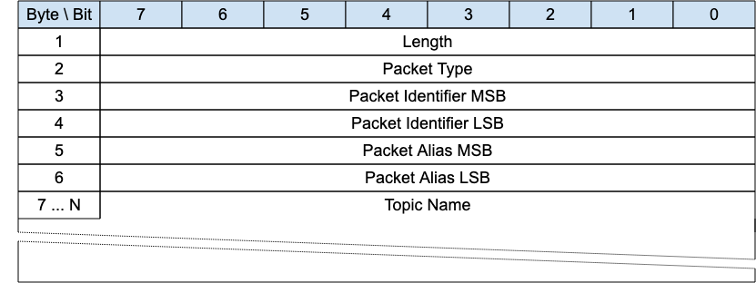

<!-- transformation-note: left upstream numbering of headings for verification -->
### 3.1.7 REGISTER

{#fig:register-packet}

The REGISTER packet is sent by a client to a GW for requesting a topic alias value for the included topic name. It is also sent by a GW to inform a
client about the topic alias value it has assigned to the included topic name.

<!-- transformation-note: left upstream numbering of headings for verification -->
#### 3.1.7.1 Length &amp; Packet Type{#register--length-and-packet-type}

The first 2 or 4 bytes of the packet are encoded according to the variable length packet header format.
Refer to [section 2.1](#structure-of-an-mqtt-sn-control-packet) for a detailed description.

<!-- transformation-note: left upstream numbering of headings for verification -->
#### 3.1.7.2 Packet Iddentifier{#register--packet-identifier}

Used to identify the corresponding REGACK packet. It should ideally be populated with a random integer value.

<!-- transformation-note: left upstream numbering of headings for verification -->
#### 3.1.7.3 Topic Alias{#register--topic-alias}

If sent by a client, it is coded 0x0000 and is not relevant; if sent by a GW, it contains the topic alias value assigned to the topic name included in
the Topic Name field.

<!-- transformation-note: left upstream numbering of headings for verification -->
#### 3.1.7.4 Topic Name{#register--topic-name}

Fixed Length UTF-8 Encoded String Contains the fully qualified topic name.
