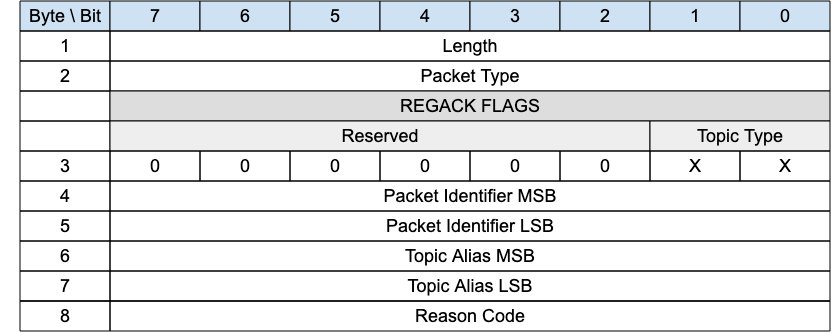

<!-- transformation-note: left upstream numbering of headings for verification -->
### 3.1.8 REGACK

{#fig:regack-packet}

The REGACK packet is sent by a client or by a GW as an acknowledgment to the receipt and processing of a REGISTER packet.

<!-- transformation-note: left upstream numbering of headings for verification -->
#### 3.1.8.1 Length &amp; Packet Type{#regack--length-and-packet-type}

The first 2 or 4 bytes of the packet are encoded according to the variable length packet header format.
Refer to [section 2.1](#structure-of-an-mqtt-sn-control-packet) for a detailed description.

<!-- transformation-note: left upstream numbering of headings for verification -->
#### 3.1.8.2 REGACK Flags

The REGACK Flags is 1 byte field in Byte position 3 of the REGACK packet.

The REGACK Flags field includes the following flag:

-   **Topic Type**. This is a 2-bit field in Bit 0 and 1 which determines the format of the topic value. Refer to [Table 10](#topic-types) for the
    definition of the various topic types.

<!-- transformation-note: the below table ref upstream 10 needs identification and verification before transforming into a semantic ref later. -->
- **Topic Alias Type**: This is a 2-bit field in Bit 0 and 1 which determines the format of the topic Id value.
  Refer to Table 10 for the definition of the various topic types.

<!-- transformation-note: left upstream numbering of headings for verification -->
#### 3.1.8.3 Packet Identifier{#regack--packet-identifier}

The same value as the Packet Identifier in the REGISTER packet being acknowledged.

<!-- transformation-note: left upstream numbering of headings for verification -->
#### 3.1.8.4 Topic Alias{#regack--topic-alias}

A Topic Alias is an integer value that is used to identify the Topic instead of the Topic Name. This numeric value is used as the Topic Alias.

<!-- transformation-note: left upstream numbering of headings for verification -->
#### 3.1.8.5 Reason Code{#regack--reason-code}

<!-- transformation-note: the below table ref upstream 9 "Reason Code Values" needs verification before transforming into a semantic ref later. -->
[Byte 8 in the REGACK packet holds the Register Reason Code.]{.mark} The values for the Register Reason Code field are shown in Table 9: Reason Code
Values. [The sender of the REGACK Packet MUST use one of the Register Reason Codes.]{.mark}
