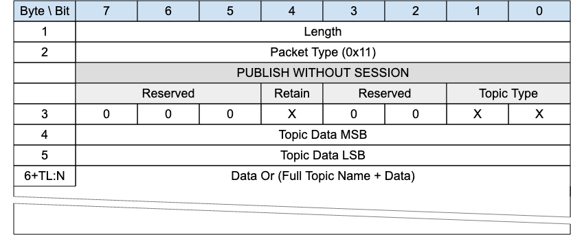

<!-- transformation-note: left upstream numbering of headings for verification -->
### 3.1.10 PUBLISH WITHOUT SESSION

{#fig:pubwos-packet}

This packet is used by both clients and gateways to publish data for a certain topic.

Normative Comment

Upon being processed, PUBLISH WITHOUT SESSION packets received by a Gateway should have their Quality of Service level set to 0 for onward transmission into the MQTT network. PUBLISH WITHOUT SESSION packets are a concept considered only valid on the Gateway side of the network.

<!-- transformation-note: the below normative comment is irritating at best, let us make that a normal paragraph as all comments should be informative only. -->
> Normative Comment
> If the Transport Layer supports broadcast, like UDP/IP, the PUBLISH WITHOUT SESSION packet is generally sent using the broadcast address as destination.

> Informative Comment
> PUBLISH WITHOUT SESSION packets received by a Gateway should not be associated with a Client Session and can be optionally discarded by the Gateway without
> being processed for onward delivery.

<!-- transformation-note: left upstream numbering of headings for verification -->
#### 3.1.10.1 Length &amp; Packet Type{#publish-without-session--length-and-packet-type}

The first 2 or 4 bytes of the packet are encoded according to the variable length packet header format.
Refer to [section 2.1](#structure-of-an-mqtt-sn-control-packet) for a detailed description.

<!-- transformation-note: left upstream numbering of headings for verification -->
#### 3.1.10.2 PUBLISH Flags{#publish-without-session--publish-flags}

The PUBLISH Flags field is 1-byte located in the Byte 3 position of the PUBLISH control packet.

The PUBLISH Flags includes the following flags:

<!-- transformation-note: the below table ref upstream 10 needs verification before transforming into a semantic ref later. -->
- **Topic Type**: This is a 2-bit field in Bit 0 and 1 which determines the format of the topic data field.
  Refer to Table 10 for the definition of the various topic types.
  NOTE: only predefined topic alias, short topic or full topic types are allowed in PUBLISH WITHOUT SESSION packets.
- **Retain**: 1 bit field stored in Bit 4 and has the same meaning as with MQTT.
  The field signifies whether the existing retained message for this topic is replaced or kept.

<!-- transformation-note: left upstream numbering of headings for verification -->
#### 3.1.10.3 Topic Data{#publish-without-session--topic-data}

Contains 2 bytes of topic length (if the topic type is Full Topic Name) or the topic alias (predefined),
or short topic name as indicated in the Topic Type field in flags.
Determines the topic which this payload will be published to.

<!-- transformation-note: left upstream numbering of headings for verification -->
#### 3.1.10.4 Data{#publish-without-session--data}

In the case of Topic Alias Type b11 the data section will be prefixed with a "Full Topic Name" encoded with a UTF-8 encoded string value of
length determined by the previously defined length field.
Thereafter, the Data field corresponds to the payload of an MQTT PUBLISH packet.
It has a variable length and contains the application data that is being published.
