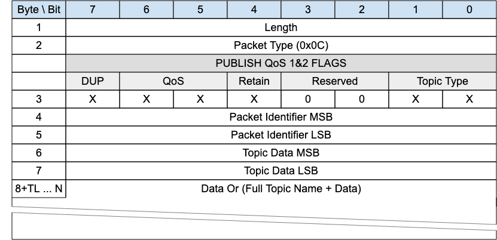

<!-- transformation-note: left upstream numbering of headings for verification -->
### 3.1.12 PUBLISH (used for QoS 1 and 2){#publish-used-for-qos-1-and-2}
<!-- transformation-note: replaced above colloquial ampersand with english "and". -->

{#fig:publish-qos-1-and-2-packet}

This packet is used by both clients and gateways to publish data for a certain topic.

<!-- transformation-note: the below normative comment is irritating at best, let us make that a normal paragraph as all comments should be informative only. -->
<!-- transformation-note: in case this comment **does** become normal normative prose, consider rewriting the lower case must as uppercase MUST. -->
<!-- transformation-note: in case this comment shall **not** become normal normative prose, consider avoiding terms like must, should, and may. -->
> Normative Comment
> PUBLISH QoS 0, 1 and 2 packets received by a Gateway must be associated with a valid Client Session.
<!-- transformation-note: replaced above colloquial ampersand with english "and". -->

<!-- transformation-note: left upstream numbering of headings for verification -->
#### 3.1.12.1 Length and Packet Type{#publish-used-for-qos-1-and-2--length-and-packet-type}

The first 2 or 4 bytes of the packet are encoded according to the variable length packet header format.
Refer to [section 2.1](#structure-of-an-mqtt-sn-control-packet) for a detailed description.

<!-- transformation-note: left upstream numbering of headings for verification -->
#### 3.1.12.2 PUBLISH Flags{#publish-used-for-qos-1-and-2--publish-flags}

The PUBLISH Flags field is 1-byte located in Byte 3 position of the PUBLISH control packet.

The PUBLISH Flags includes the following flags:

<!-- transformation-note: the below table ref upstream 10 needs verification before transforming into a semantic ref later. -->
- **Topic Type**: This is a 2-bit field in Bit 0 and 1 which determines the format of the topic data field.
  Refer to Table 10 for the definition of the various topic types.
- **QoS**: This is a 2-bit field stored in Bit 5 and 6.
  QoS has the same meaning as with MQTT indicating the Quality of Service.
  Set to "0b00" for QoS 0, "0b01" for QoS 1, "0b10" for QoS 2, and "0b11" for QoS -1.
  For a detailed description of the various Quality Of Service levels please refer to the operational behavior section.
- **DUP**: 1 bit field stored in Bit 7 and has the same meaning as with MQTT.
  It notes the duplicate delivery of packets.
  If the DUP flag is set to "0", it signifies that the packet is sent for the first time.
  If the DUP flag is set to "1", it signifies that the packet was retransmitted.
- **Retain**: 1 bit field stored in Bit 4 and has the same meaning as with MQTT.
  The field signifies whether the existing retained message for this topic is replaced or kept.

<!-- transformation-note: left upstream numbering of headings for verification -->
#### 3.1.12.4 Packet Id{#publish-used-for-qos-1-and-2--packet-id}

Same meaning as the MQTT "Packet ID"; only relevant in case of QoS levels 1 and 2, otherwise coded 0x0000.

<!-- transformation-note: left upstream numbering of headings for verification -->
#### 3.1.12.5 Topic Data{#publish-used-for-qos-1-and-2--topic-data}

Contains 2 bytes of topic length (if the topic type is Full Topic Name) or the topic alias (predefined or normal),
or short topic name as indicated in the Topic Type field in flags.
Determines the topic which this payload will be published to.

<!-- transformation-note: left upstream numbering of headings for verification -->
#### 3.1.12.6 Data{#publish-used-for-qos-1-and-2--data}

The Data field corresponds to the payload of an MQTT PUBLISH packet.
It has a variable length and contains the application data that is being published.
