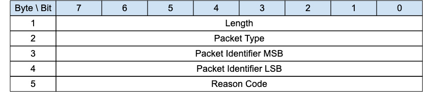

<!-- transformation-note: left upstream numbering of headings for verification -->
### 3.1.13 PUBACK – Publish Acknowledgement{#puback-publish-acknowledgement}

{#fig:puback-packet}

A PUBACK packet is the response to a PUBLISH packet with QoS 1.
It can also be sent as response to a PUBLISH packet of any QoS (with the exception of QoS -1, or PUBLISH WITHOUT SESSION) in case of an error;
the error reason is then indicated in the Reason Code field.

<!-- transformation-note: left upstream numbering of headings for verification -->
#### 3.1.13.1 Length &amp; Packet Type{#puback-publish-acknowledgement--length-and-packet-type}

The first 2 or 4 bytes of the packet are encoded according to the variable length packet header format.
Refer to [section 2.1](#structure-of-an-mqtt-sn-control-packet) for a detailed description.

<!-- transformation-note: left upstream numbering of headings for verification -->
#### 3.1.13.2 Packet Id{#puback-publish-acknowledgement--packet-id}

Same value as the one contained in the corresponding PUBLISH packet.

<!-- transformation-note: left upstream numbering of headings for verification -->
#### 3.1.13.3 Reason Code{#puback-publish-acknowledgement--reason-code}

<!-- transformation-note: the below table ref upstream 9 "Reason Code Values" needs verification before transforming into a semantic ref later. -->
Byte 5 in the PUBACK packet holds the Reason code in response to the PUBLISH packet.
The PUBACK Reason Codes are shown in Table 9: Reason Code Values.
The Client or Server sending the PUBACK packet MUST use one of the PUBACK Reason Codes.
