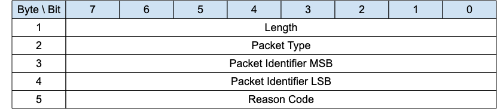

<!-- transformation-note: left upstream numbering of headings for verification -->
### 3.1.14 PUBREC (QoS 2 delivery part 1){#pubrec-qos-2-delivery-part-1}

{#fig:pubrec-packet}

A PUBREC packet is the response to a PUBLISH packet with QoS 2. It is the second packet of the QoS 2 protocol exchange.

<!-- transformation-note: left upstream numbering of headings for verification -->
#### 3.1.14.1 Length &amp; Packet Type{#pubrec-qos-2-delivery-part-1--length-and-packet-type}

The first 2 or 4 bytes of the packet are encoded according to the variable length packet header format.
Refer to [section 2.1](#structure-of-an-mqtt-sn-control-packet) for a detailed description.

<!-- transformation-note: left upstream numbering of headings for verification -->
#### 3.1.14.2 Packet Id{#pubrec-qos-2-delivery-part-1--packet-id}

Same value as the one contained in the corresponding PUBLISH packet.

<!-- transformation-note: left upstream numbering of headings for verification -->
#### 3.1.14.3 Reason Code{#pubrec-qos-2-delivery-part-1--reason-code}

<!-- transformation-note: the below table ref upstream 9 "Reason Code Values" needs verification before transforming into a semantic ref later. -->
Byte 5 in the PUBREC packet holds the Reason code in response to the PUBLISH packet.
The PUBREC Reason Codes are shown in Table 9: Reason Code Values.
The Client or Server sending the PUBREC packet MUST use one of the PUBREC Reason Codes.
