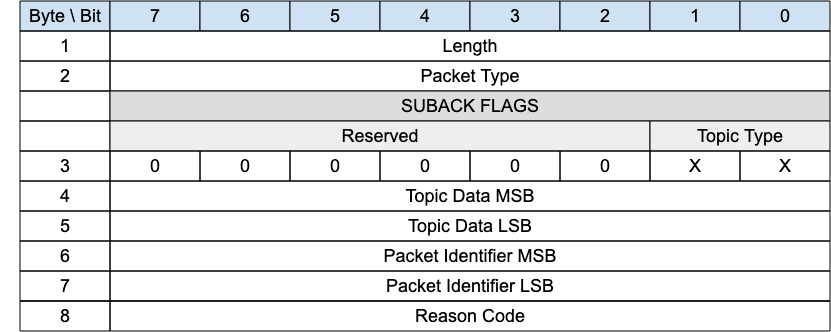

<!-- transformation-note: left upstream numbering of headings for verification -->
### 3.1.18 SUBACK

{#fig:suback-packet}

The SUBACK packet is sent by a gateway to a client as an acknowledgment to the receipt and processing of a SUBSCRIBE packet.

<!-- transformation-note: left upstream numbering of headings for verification -->
#### 3.1.18.1 Length &amp; Packet Type{#suback--length-and-packet-type}

The first 2 or 4 bytes of the packet are encoded according to the variable length packet header format.
Refer to [section 2.1](#structure-of-an-mqtt-sn-control-packet) for a detailed description.

<!-- transformation-note: left upstream numbering of headings for verification -->
#### 3.1.18.2 Flags{#suback--flags}

The SUBACK Flags field is 1-byte located in Byte 3 position of the SUBACK control packet.
The SUBACK Flags includes the following flags:

<!-- transformation-note: the below table ref upstream 10 needs verification before transforming into a semantic ref later. -->
- **Topic Type**: This is a 2-bit field in Bit 0 and 1 which determines the format of the topic data field.
  Refer to Table 10 for the definition of the various topic types.

<!-- transformation-note: left upstream numbering of headings for verification -->
#### 3.1.18.3 Topic Data{#suback--topic-data}

In case of "accepted" the value that will be used as topic alias by the gateway when sending PUBLISH packets to the client
(not relevant in case of subscriptions to a short topic name or to a topic name which contains wildcard characters).

<!-- transformation-note: left upstream numbering of headings for verification -->
#### 3.1.18.4 Packet Identifier{#suback--packet-identifier}

Same value as the one contained in the corresponding SUBSCRIBE packet.

<!-- transformation-note: left upstream numbering of headings for verification -->
#### 3.1.18.5 Reason Code{#suback--reason-code}

<!-- transformation-note: the below table ref upstream 9 "Reason Code Values" needs verification before transforming into a semantic ref later. -->
Byte 8 in the SUBACK packet holds the Reason code in response to the SUBSCRIBE packet.
The SUBACK Reason Codes are shown in Table 9: Reason Code Values.
The Server sending the SUBACK packet MUST use one of the SUBACK Reason Codes.
