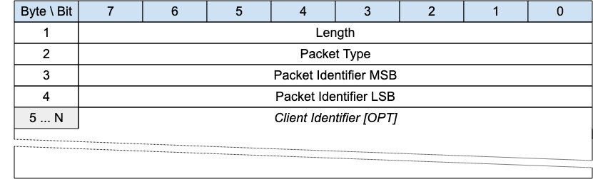

<!-- transformation-note: left upstream numbering of headings for verification -->
### 3.1.21 PINGREQ

{#fig:pingreq-packet}

As with MQTT, the PINGREQ packet is an "are you alive" packet that is sent from or received by a connected client.

<!-- transformation-note: left upstream numbering of headings for verification -->
#### 3.1.21.1 Length &amp; Packet Type{#pingreq--length-and-packet-type}

The first 2 or 4 bytes of the packet are encoded according to the variable length packet header format.
Refer to [section 2.1](#structure-of-an-mqtt-sn-control-packet) for a detailed description.

<!-- transformation-note: left upstream numbering of headings for verification -->
#### 3.1.21.2 Client Identifier (optional){#pingreq--client-identifier}

Contains the client identifier (client id);
this field is optional and is included by a "sleeping" client when it goes to the "awake" state and is waiting for packets sent by the server/gateway.

The Client Identifier MUST be a Fixed Length UTF-8 Encoded String.
