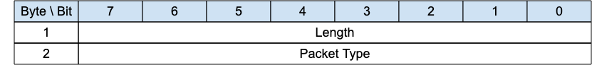

<!-- transformation-note: left upstream numbering of headings for verification -->
### 3.1.24 WAKEUP - Wake up request{#wakeup}

{#fig:wakeup-packet}

The wakeup packet is a signal sent from the gateway to a client. It is an indication from the gateway that the client should wake up.
The client is not obliged to honor this request, nor may it even receive the packet.
It can choose to ignore the request, or undertake one of the sequences outlined in the section [4.25 Sleeping clients](#sleeping-clients) section.
The client need not respond to this packet.

<!-- transformation-note: left upstream numbering of headings for verification -->
#### 3.1.24.1 Length and Packet Type{#wakeup--length-and-packet-type}

The first 2 or 4 bytes of the packet are encoded according to the variable length packet header format.
Refer to [section 2.1](#structure-of-an-mqtt-sn-control-packet) for a detailed description.

<!-- transformation-note: left upstream numbering of headings for verification -->
#### 3.1.24.2 WAKEUP Actions{#wakeup-actions}

[The Client MAY choose to follow the AWAKE procedure in response to receiving a WAKEUP packet] \[MQTT-SN-3.1.21.4-2\].
