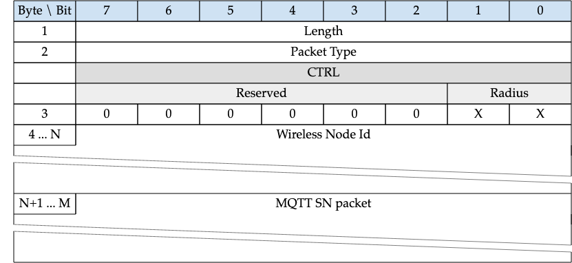

<!-- transformation-note: left upstream numbering of headings for verification -->
### 3.1.25 Forwarder Encapsulation

{#fig:forwarder-encapsulation}

<!-- transformation-note: below section reference to 4 "Operational Behavior" requires verification before turning into a semantic reference. -->
As detailed in Section 4, MQTT-SN clients can also access a gateway via a forwarder in case the gateway is not directly attached to their WSNs.
The forwarder simply encapsulates the MQTT-SN frames it receives on the wireless side and forwards them unchanged to the gateway;
in the opposite direction, it decapsulates the frames it receives from the gateway and sends them to the clients, unchanged too.

<!-- transformation-note: left upstream numbering of headings for verification -->
#### 3.1.25.1 Length{#forwarder-encapsulation--length}

1-byte long, specifies the number of bytes up to the end of the "Wireless Node Id" field (incl. the Length byte itself)

<!-- transformation-note: left upstream numbering of headings for verification -->
#### 3.1.25.2 Packet Type{#forwarder-encapsulation--packet-type}

Coded "0xFE", see Table 6

<!-- transformation-note: left upstream numbering of headings for verification -->
#### 3.1.25.3 Ctrl

The Ctrl byte contains control information exchanged between the GW and the forwarder.

<!-- transformation-note: no table col span in markdown, but we should specify bitfields better (than with layout tables) anyway --> 
| Bit | 7        | 6        | 5        | 4        | 3        | 2        | 1      | 0      |
|:----|:---------|:---------|:---------|:---------|:---------|:---------|:-------|:-------|
|     | Reserved | Reserved | Reserved | Reserved | Reserved | Reserved | Radius | Radius |
|     | 0        | 0        | 0        | 0        | 0        | 0        | X      | X      |

Table 54: Format of the ctrl byte
<!-- transformation-note: above upstream table number will be replaced by auto-numbering later. -->

<!-- transformation-note: left upstream numbering of headings for verification -->
#### 3.1.25.4 Radius{#forwarder-encapsulation--radius}

Transmission radius (only relevant in direction gateway to forwarder).

<!-- transformation-note: left upstream numbering of headings for verification -->
#### 3.1.25.5 Wireless Node Id

Identifies the wireless node which has sent or should receive the encapsulated MQTT-SN packet.
The mapping between this Id and the address of the wireless node is implemented by the forwarder, if needed.

<!-- transformation-note: left upstream numbering of headings for verification -->
#### 3.1.25.6 MQTT SN Packet

The MQTT-SN packet, encoded according to the packet type.
