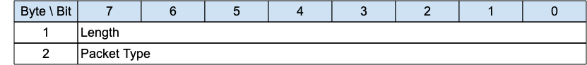

## WAKEUP - Wake up request{#wakeup---wake-up-request}

*Figure 3-24 -- WAKEUP Packet*

<!-- .width="6.5in", .height="0.7222222222222222in" -->

The WAKEUP Packet is sent from the Server to the Client to request that it transition to the Awake state. The client is not obliged to honor this request - it might not even receive the packet. It can choose to ignore the request, or undertake one of the sequences outlined in [sec](#sleeping-clients). The client need not respond to this packet.

### WAKEUP Header{#wakeup-header}

The first 2 or 4 bytes of the packet are encoded according to the variable length packet header format. Refer to [sec](#structure-of-an-mqtt-sn-control-packet) for a detailed description.

### WAKEUP Actions{#wakeup-actions}

«<mark title="Requirement MQTT-SN-3.14.2-1">The Client MAY choose to follow the AWAKE procedure in response to receiving a WAKEUP packet</mark>»[MQTT‑SN‑3.14.2‑1](#tab-MQTT-SN-3.14.2-1).
