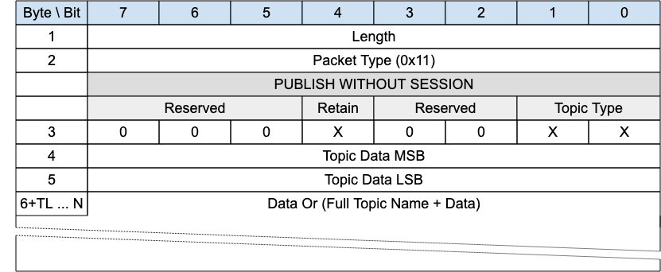
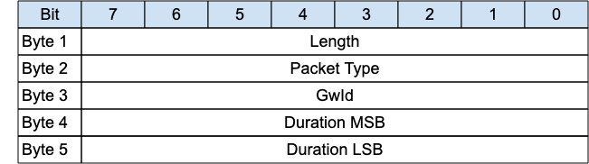

# Package Diagrams (Table)

The diagrams representing the bytefields of MQTT-SN packages
in a manner very similar to the incoming draft as well as to
the existing MQTT v5.0 specification.

## Tools

Open source tool `bytefield-svg` (and in case rasterization is needed `svgexport`).

Source of `bytefield-svg` is at <https://github.com/Deep-Symmetry/bytefield-svg/tree/main>.
Additional documentation of the domain specific language (DSL) essentially clojure based is
at <https://bytefield-svg.deepsymmetry.org/bytefield-svg/>.

Both tools can be installed e.g. per `npm` (the node package manager) or the other 42 such managers:

```console
❯ npm install -g bytefield-svg
❯ npm install -g svgexport
```

### Usage

The source files are in Clojure using the functions of the `bytefield-svg` package as a Domain Specific Language (DSN):

Reducing the Rococo a bit more starting with the `PUBWOS` and `PUBLISH - QoS 0` package diagrams:

Example of rendering of SVG from these text files (and subsequent rasterization to PNG files):

```console
❯ package='pubwos'
❯ bytefield-svg -s "${package}".edn -o "${package}".svg
❯ svgexport "${package}".svg "${package}".png '100%'
```

Example (suggested reduced decorum with `PUBWOS`package):

```clojure
;; This is the source for 3.1.10 PUBWOS package diagram of MQTT-SN v2.0.
(def boxes-per-row 9)
(def box-width 90)
(def left-margin 20)
(defattrs :plain {:font-family "Arial" :font-size 18})
(defattrs :cursive {:font-family "Arial" :font-size 18 :font-style "italic"})
(defattrs :bg-lightblue {:fill "#cfe2f3"})
(defattrs :bg-mediumgray {:fill "#dddddd"})
(defattrs :bg-lightgray {:fill "#eeeeee"})
;;(defattrs :left {:text-anchor "start"})
(defattrs :byte {:span 8})

(defn row-header-fn
  [{:keys [address gap?]}]
  (let [addr-label (str " ")]
    (text addr-label)))

(draw-box (text "Byte \\ Bit") :bg-lightblue)
(doseq [val (str/split "7,6,5,4,3,2,1,0" #",")]
  (draw-box (text val) :bg-lightblue))

(draw-box (text "1"))
(draw-box "Length" :byte)

(draw-box (text "2"))
(draw-box "Packet Type (0x11)" :byte)

(draw-box (text ""))
(draw-box (text "PUBLISH WITHOUT SESSION") [:bg-mediumgray :byte])

(draw-box (text ""))
(draw-box "Reserved" [:bg-lightgray {:span 3}])
(draw-box "Retain" [:bg-lightgray {:span 1}])
(draw-box "Reserved" [:bg-lightgray {:span 2}])
(draw-box "Topic Type" [:bg-lightgray {:span 2}])

(draw-box (text "3"))
(draw-box "0" {:span 1})
(draw-box "0" {:span 1})
(draw-box "0" {:span 1})
(draw-box "X" {:span 1})
(draw-box "0" {:span 1})
(draw-box "0" {:span 1})
(draw-box "X" {:span 1})
(draw-box "X" {:span 1})

(draw-box (text "4"))
(draw-box "Topic Data MSB" :byte)

(draw-box (text "5"))
(draw-box "Topic Data LSB" :byte)

(draw-box (text "6+TL ... N"))
(draw-gap "Data Or (Full Topic Name + Data)" :byte)

(draw-bottom)
```



Figure 1: Rasterized `PUBWOS` package diagram (with reduced decorum)

Example (of initial Rococo with `ADVERTISE` package):

```clojure
;; This is the source for 3.1.1 ADVERTISE package diagram of MQTT-SN v2.0.
(def boxes-per-row 9)
(def box-width 70)
(def left-margin 20)
(defattrs :plain {:font-family "Arial" :font-size 18})
(defattrs :bg-lightblue {:fill "#cfe2f3"})
(defattrs :left {:text-anchor "start"})
(defattrs :byte {:span 8})

(defn row-header-fn
  [{:keys [address gap?]}]
  (let [addr-label (str " ")]
    (text addr-label)))

(draw-box (text "Bit") :bg-lightblue)
(doseq [val (str/split "7,6,5,4,3,2,1,0" #",")]
  (draw-box (text val) :bg-lightblue))

(draw-box (text "Byte 1") :left)
(draw-box "Length" :byte)

(draw-box (text "Byte 2") :left)
(draw-box "Packet Type" :byte)

(draw-box (text "Byte 3") :left)
(draw-box "GwId" :byte)

(draw-box (text "Byte 4") :left)
(draw-box "Duration MSB" :byte)

(draw-box (text "Byte 5") :left)
(draw-box "Duration LSB" :byte)

(draw-bottom)
```



Figure 2: Rasterized `ADVERTISE` package diagram (with more decorum)

## What does "Table" mean?

Here table indicates that these representations try to stay close to the look of the 
existing package diagrams displayed in MQTT v5.0 and the MQTT-SN v2.0 editor draft as of May, 2024.

