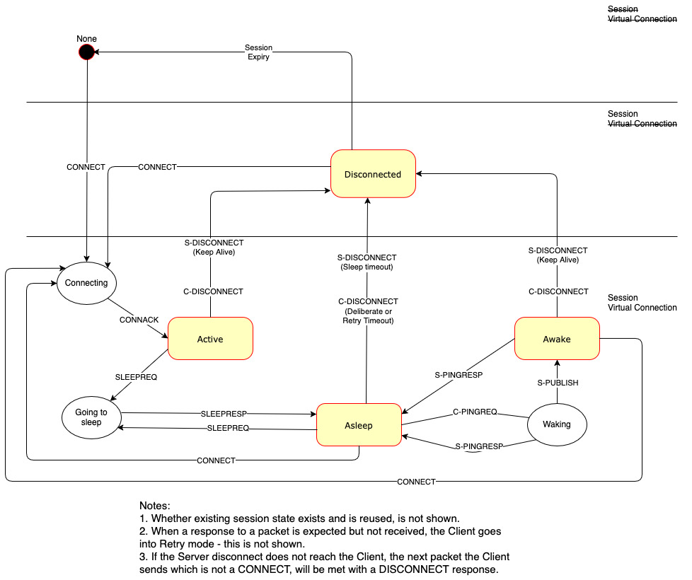
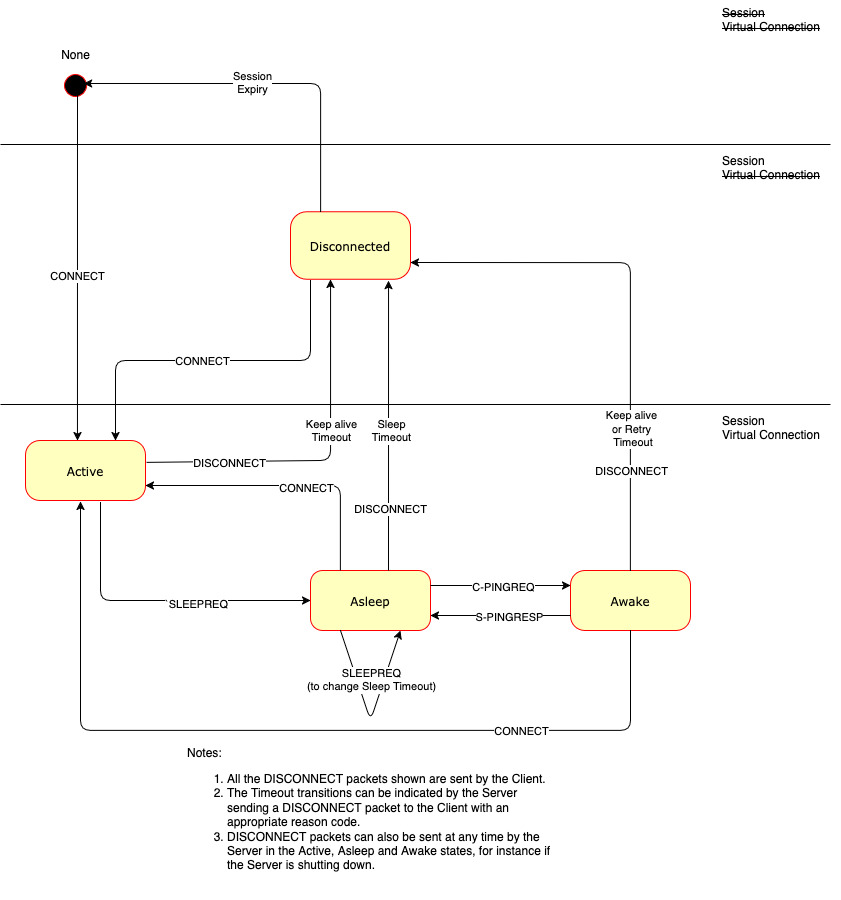

## C.5 Client State Diagrams{#c.5-client-state-diagrams}

The following diagrams are illustrative, graphical views of the states and transitions. They are not comprehensive but included for guidance.

*Figure C-7 -- Server View of Client States - informative*

<!-- .width="6.5in", .height="6.958333333333333in" -->

*Figure C-8 -- Server View of Client States - informative*

<!-- .width="6.5in", .height="6.958333333333333in" -->

<!-- These two figures both contained image27.jpg which was identical with ServerState.jpg -->
<!-- TODO: Is this a doubled figure and we did not want to show the ClientState.jpg or ...? -->
