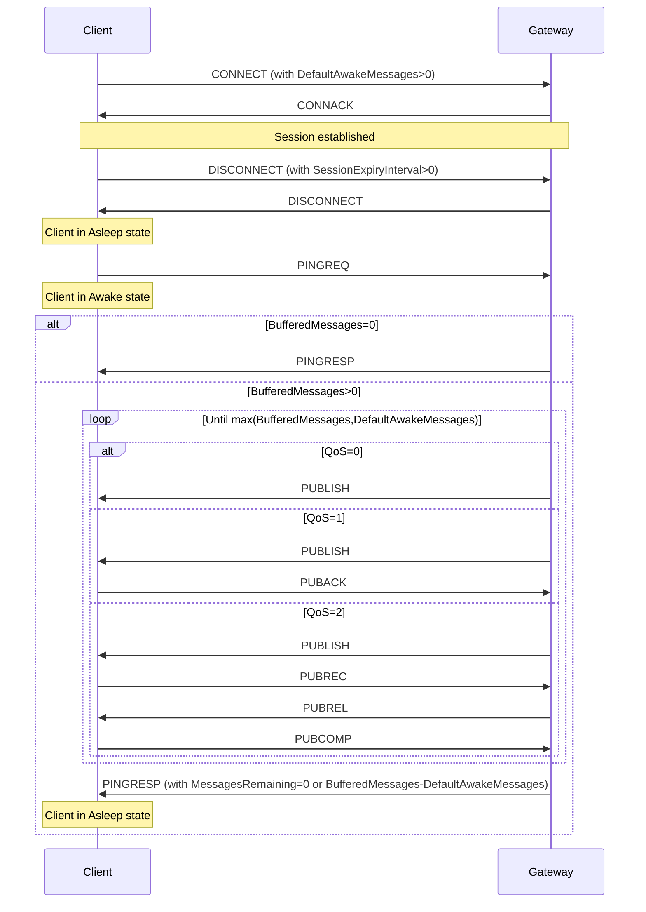

<!-- transformation-note: left upstream numbering of headings for verification -->
## 4.25 Sleeping Clients
<!-- transformation-note: fixed title case in above heading by replacing "clients" with "Clients". -->

Sleeping clients are clients residing on (battery-operated) devices that want to save as much energy as possible.
These devices need to enter a sleep mode whenever they are not active and will wake up whenever they have data to send or to receive.
The server/gateway needs to be aware of the sleeping state of these clients and will buffer messages destined to them for later delivery when they wake up.

If a client wants to sleep, it sends a DISCONNECT packet which contains a sleep session expiry interval.
The server/gateway acknowledges that packet with a DISCONNECT packet and considers the client for being in asleep state.
The asleep state is supervised by the server/gateway with the indicated sleep session expiry interval.
If the server/gateway does not receive any packet from the client for a period longer than the sleep session expiry interval,
the server/gateway will consider that client as lost and - as with the keep alive procedure - activates for example the Will feature.

During the asleep state, packets that need to be sent to the client are buffered at the server/gateway.
The gateway MUST buffer application messages of quality-of-service 1 and 2.
<!-- transformation-note: replaced ampersand with the english word "and" linking qos 1 and 2 above. -->

>Informative comment
>
> The gateway may choose to buffer messages of Quality-of-Service 0, whilst the client is sleeping and is within its session expiry interval.

The sleep timer is stopped when the server/gateway receives a PINGREQ from the client.
Like the CONNECT packet, this PINGREQ packet contains the Client Id.
The identified client is then in the awake state.
If the server/gateway has buffered packets for the client, it will send these packets to the client,
acknowledging the Default Awake Messages value sent in the CONNECT packet.
If the number of messages buffered on the gateway queue exceeds the value specified by the client in the Default Awake Messages field,
the gateway shall send only the Default Awake Messages value number of messages, and cut short the AWAKE cycle,
responding with a PINGRESP with a messages-left value of either the number of messages remaining in the gateway buffer or 0xFFFF
(meaning undetermined number of messages greater than 0 remaining).

During the AWAKE state, for each packet the gateway sends to the client, the application messages’ quality of service shall be honored,
and a full packet interaction shall take place including all normative phases of acknowledgement, including any associated retransmission logic.
If, during the delivery of application messages from the gateway to the client, the gateway detects a timeout in the delivery,
it should transition the client state to LOST and a DISCONNECT packet with error sent to the device.

The transfer of packets to the client is closed by the server/gateway by means of a PINGRESP packet,
i.e. the server/gateway will consider the client as asleep and restart the sleep timer again after having sent the PINGRESP packet.
If the server/gateway does not have any packets buffered for the client, it answers immediately with a PINGRESP packet,
returns the client back to the asleep state, and restarts the sleep timer for that client.

<!-- transformation-note: section 3.18 is SUBACK, beed to verify the correctness of the below section reference. -->
After having sent the PINGREQ to the server/gateway,
the client uses the "retransmission procedure" of section 3.18 to supervise the arrival of packets sent by the server/gateway,
i.e. it restarts timer Tretry when it receives a packet other than a PINGRESP, and stops it when it receives a PINGRESP.
The PINGREQ packet is retransmitted, and timer Tretry restarted when timer Tretry times out.
To avoid a flattening of its battery due to excessive retransmission of the PINGREQ packet (e.g. if it loses the gateway),
the client should limit the retransmission of the PINGREQ packet
(e.g. by a retry counter) and go back to sleep when the limit is reached and it still does not receive a PINGRESP packet.

From the asleep state, a client can return either to the active state by sending a CONNECT packet or to the disconnected state by sending a normal DISCONNECT packet
(i.e. without session expiry interval field).
The client can also modify its sleep configuration by sending a DISCONNECT packet with a new value of the session expiry interval.

Note that a sleeping client should go the awake state only if it just wants to check whether the server/gateway has any messages buffered for it and return as soon as possible to the asleep state without sending any packets to the server/gateway.
Otherwise, it should return to the active state by sending a CONNECT packet to the server/gateway.

Topic Alias mappings exist only while a client is active and last for the entire session expiry interval of the active state.
Therefore, the gateway must re-register any topic alias’s during the AWAKE state, which will last until the last PINGRESP is issued.

>Informative comment
>
>The gateway should attempt to make the best effort to reuse the same topic alias’ mappings that existed during any initial associated ACTIVE states.

<!--  -->

Figure 5: Awake ping packet flush
<!-- transformation-note: above figure number will be replaced by auto-numbering later. -->
